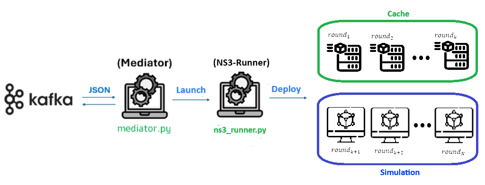

# Network Simulator for Federated Settings [**(TUC)**](https://www.tuc.gr/en/home)

This repository contains the **[NS-3](https://www.nsnam.org/)**–based network simulation system developed within
the [**CREXDATA**](https://crexdata.eu/) Horizon project.

The aim of this component is to provide a reproducible and controllable network
simulation environment for analyzing communication behavior in distributed and
federated learning systems. By modeling heterogeneous network topologies and
traffic patterns, the system enables controlled experimentation on latency,
synchronization, convergence, and communication overhead, allowing researchers
to tune system parameters and reliably predict system behavior under realistic
and unstable network conditions.

The most up-to-date version of this component is maintained at:
https://github.com/psklavos1/NS3-Sys

---

## Architecture



### Mediator

The system is centered around a persistent orchestrator, called the **Mediator**,
which runs as a long-lived process and coordinates **network simulation jobs**
based on incoming configurations.

The Mediator continuously listens to a predefined **Kafka** topic for structured
JSON job descriptions and launches **NS-3 simulation jobs** accordingly.
Jobs are executed in isolation and in a non-blocking manner, allowing multiple
simulations to run concurrently or sequentially in the background.

### NS3 Runner

The NS3 Runner acts as an isolated job executor.
For each job, the specified communication environment is instantiated within NS-3,
and a simulation experiment is executed to collect communication performance
statistics.

Simulation results are published to a Kafka topic in JSON format and are also
stored locally as records for future reuse. Simulations are deterministic;
if a requested configuration has already been executed, results are retrieved
from cache. When additional simulation rounds are requested, only the missing
rounds are executed and appended to the existing records.

---

## Structure

Only the CREXDATA-relevant parts of the NS-3 distribution are shown below.
All other NS-3 directories remain unchanged and are omitted for clarity.

```text
.
├── common/                         # Shared utilities (logging, helpers)
├── configs/                        # Sample job configurations
├── kafka_utils/                    # Helpers for Kafka communication
├── logs/                           # Job outputs and logs
|── ns3/                            
│   ├── build/                      # Compilation directory
│   ├── records/                    # Stored records from previous jobs
│   ├── scratch/                    # NS3 directory for networking experiments
|   |  ├── fl_simulation/           # Implementation of the Ns3 simulator
|   |
|   ├── scripts/                    # Backend orchestration scripts
|   |  ├── build.sh                 # Compilation of NS3
|   |  ├── clean.sh                 # Clean complied files
|   |  ├── cleanup_records.sh       # Clean prior execution records
|   |  ├── configure.sh             # configuration of NS3 
|   |
│   ├── ns3_runner.py               # Job executor
│   ├── runner_utils.py             # Utiliities for job handler
|   └── ...                         # Standard NS-3 distribution files
|  
├── scripts/                        # System-level utility scripts
├── mediator.py                     # Long-running orchestrator (system entry point)
├── README.md                       # System documentation
└── requirements.txt                # Python dependencies
```

---

## Setup 
The system setup steps are summarized as follows:

#### 1) Clone the repository
```bash
git clone https://github.com/psklavos1/NS3-Sys.git
cd NS3-Sys
```


#### 2) Create the environmet
We provide an example setup using conda.

```bash
conda create -n ns3-env python=3.11 -y
conda activate ns3-env
```

#### 3) Install python requirements
```bash
pip install -r requirements.txt
```

#### 4) Setup NS3
```bash
cd ns3                             # Move to Ns3 directory
./scripts/configure optimized      # Configure for optimized performance
./scripts/build                    # Compile NS3 libraries and experiment code

```
 **Note**: NS3 Setup is performed once. The code is configured to run without rebuilding the project binaries for stability. In case of installation corruption, the repository can be cleaned up as follows:


```bash
./scripts/clean.sh (deep)         # clean up compilled data and optionally the configuration too
```
> After cleanup **step 4** needs to be repeated.

---

## Usage

This system supports two types of requests:
1. **simulation**: Constructs a network with the specified conditions and performs a simulation within NS3.
2. **list_results**: Sends to a specified topic the list of recorded experiments. Users can identify prior runs to better exploit cached records for immediate lookups.

On **simulation** requests, the produced outputs are sent for downstream handlig to an output topic specified within the `config` via **Kafka** in **Json** format. Theya are also kept in `ns3/records` for future resuse.

On **query (list_result)** requests, a **Json** formatted history is also transmitted through **Kafka** to the specied topic, containing all results stored in memory.

### Demo

To experiment with the mediator 2 demo configurations are provided in the `/configs` for testing the aformentioned operations. For a rapid demonstration perform the following:

1. **Run Mediator**  
    ```bash
    python mediator.py --topic <configTopic>
    ```

2. **Send Demo config**  
    ```bash
    ./scripts/send_config.py --topic <configTopic> --configPath <configs/simulation.json | configs/list_results.json>
    ```

3.  **Monitor outputs**
```bash
kafka-console-consumer.sh --bootstrap-server <broker> --topic <outputTopic> --from-beginning
```

> Use the Kafka **kafka-console-consumer.sh** utility to monitor the specified broker and topic from the configs. This script is located at the local Kafka repository.
    

--- 

## Configuration

### NS-3 Simulation (`mode: "simulation"`)

Execution of an NS-3–based network simulation job for modeling communication behavior
in distributed and federated learning setups.


#### Federated Learning Parameters

Defines the federated learning setup whose communication behavior is simulated.

| Field | Description |
|------|------------|
| `model_size` | Size of the transmitted model (in MB) |
| `total_rounds` | Total number of federated learning rounds |
| `num_clients` | Total number of participating clients |
| `clients_per_round` | Number of clients selected per round |
| `sync_method` | Synchronization strategy (e.g. [synchronous or fda variations](https://www.openproceedings.org/2025/conf/edbt/paper-113.pdf)) |

#### Simulation Control

Controls execution behavior of the NS-3 simulation.

| Field | Description |
|------|------------|
| `forceRun` | Force execution even if cached results exist |
| `parallelism` | Number of simulation rounds executed in parallel |

#### Output Configuration

Specifies how simulation results are published.

| Field | Description |
|------|------------|
| `topic_out` | Kafka topic used to publish simulation results |
| `kafka_broker.ip` | Kafka broker IP address |
| `kafka_broker.port` | Kafka broker port |

#### Network Configuration

Defines the simulated network environment.

| Field | Description |
|------|------------|
| `server_datarate` | Available bandwidth at the server |
| `client_mobility` | Enable or disable client mobility |
| `max_packet_size` | Maximum packet size (bytes) |
| `tx_gain` | Transmission gain applied to wireless links |
| `wifi_performance_standard` | WiFi performance preset (grouped various setup elements to reduce cofiguration complexity) |

#### Network Topology

Specifies spatial placement of server and clients.

| Field | Description |
|------|------------|
| `server.coordinates` | 3D coordinates of the server node |
| `clients[].id` | Client identifier |
| `clients[].coordinates` | 3D coordinates of each client node |

---

### Query (`mode: "list_results"`)

Retrieves previously executed simulation results from the local records
without launching new NS-3 simulations.

Only the fields required to locate and publish stored results are needed.

| Field | Description |
|------|------------|
| `ns3.output.topic_out` | Kafka topic used to publish stored results |
| `ns3.output.kafka_broker.ip` | Kafka broker IP address |
| `ns3.output.kafka_broker.port` | Kafka broker port |

This operation does **not** require federated learning parameters,
simulation controls, or network topology definitions.

---

## License 

This project is licensed under the MIT License — see the [LICENSE](LICENSE) file for details.

---
## Acknowledgments

The research conducted in this repository is supported by the European Union’s
Horizon 2020 research and innovation programme under grant agreement No. 101092749,
project [**CREXDATA**](https://crexdata.eu/). This contribution is provided on
behalf of the [**Technical University of Crete (TUC)**](https://www.tuc.gr/en/home).

