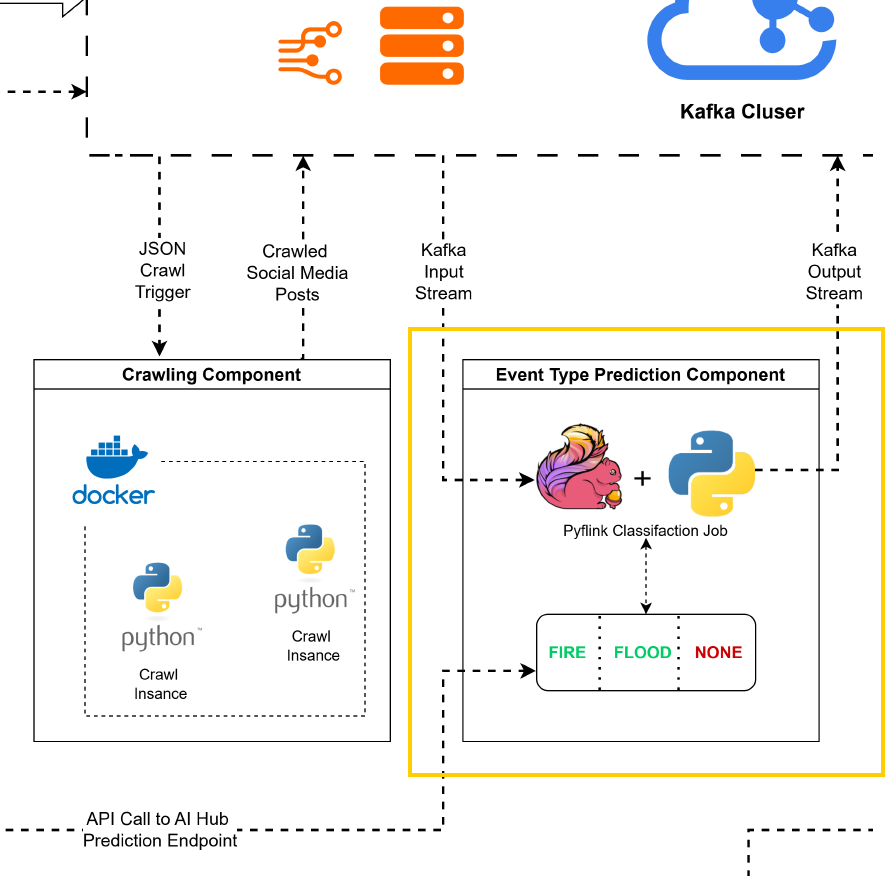

# text-mining-integration
Contains repositories for T4.5 text mining integration in CREXDATA.

# ./aihub:
## About
Contains sample RapidMiner processes and RapidMiner AI Hub and custom operators.
  - *custom-operators*: contains x-crawler custom opeator.
  - *data*: contains sample data for running RM processes.
  - *endpoints*: RM processes to create endpoints on AI Hub.
  - *models*: directory to store event-type prediction models, and LLMs for QA.
  - *processes*: sample RM processes.

## requirements 
  - RapidMiner AI Studio Software 2024.1
  - RapidMiner AI Studio extensions:
    - *Generative AI*
    - *Generative Models*
    - *Python Scripting*
    - *Custom Operators*
    - *Text Processing*
    - *Operator Toolbox*
  - rm-genai python environment (follow [instructions](https://docs.rapidminer.com/2024.1/studio/generative-ai/index.html)), and then setup conda enviroment with rm_genai.yml provided in *./aihub*.

# ./flink-2:
Contains Flink 2 setup docker container for event-type prediction streaming job. This setup ensures there is a Apache Flink process running and classifying incoming social media messages as *fire*, *flood*, or *none* as shown in the diagram. This flink job makes calls to a Rapidminer AI Hub endpoint for model scoring.

## requirements
  - Docker.
  - Rapiminer AI Hub API endpoint url, setup in *./aihub*.
  - Keystore and truststore files to access Kafka cluster (*kafka.keystore.jks*, *kafka.keystore.jks* saved in *./flink-2/shared/kafka_auth_files/*)

For container setup, follow *README* in *./flink-2*
