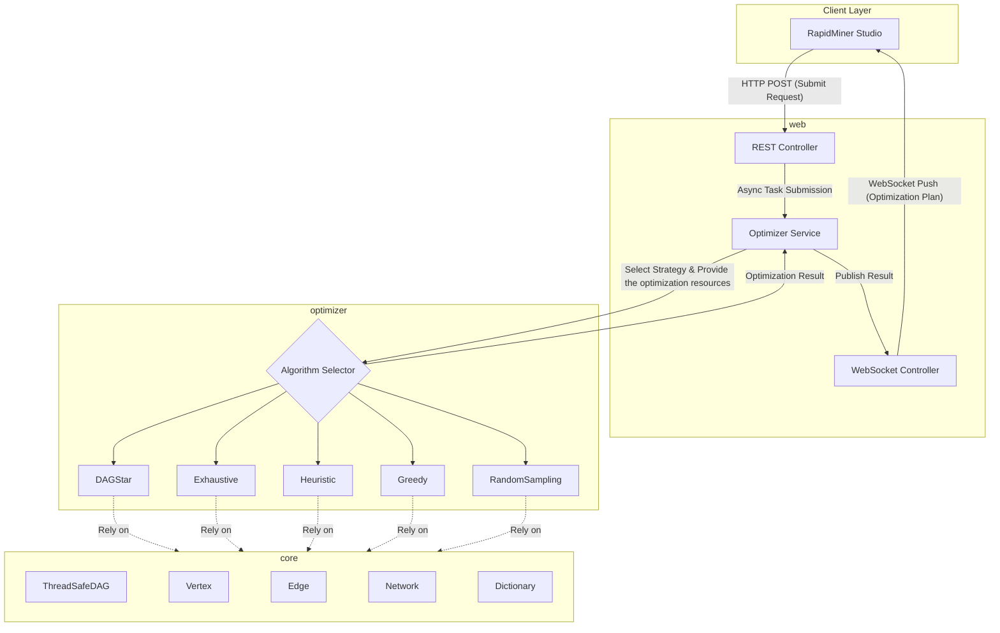

# Edge-to-Cloud Optimization component

This repository contains all the code of the optimization service, devdloped by the Technical University of Crete, of the CREXDATA 
project. The Edge-to-Cloud Optimization component is responsible for:

1) Receiving RapidMiner workflow definitions and infrastructure topologies via REST API.
2) Performing the optimization using an algorithm of the ones described in Deliverable D4.2 of the CREXDATA project.
3) Returning the optimized workflow via WebSocket to the AI Studio front-end.
4) Saving the optimized workflow to elastic for usage outside of AI Studio

## 1. System Architecture

The system is composed of three decoupled modules:


## 2. The Optimization Engine
The optimization engine consists of several algorithms that can be selected based on the request parameters.
The main algorithms implemented are:
- **DAG***: An optimal algorithm that significantly prunes the search space
- **Exhaustive Search**: A brute-force approach that evaluates all possible configurations
- **Heuristic Search**: A faster, non-optimal approach that uses a pareto front to guide its search
- **Greedy Algorithm**: A simple, fast approach that makes local optimal choices at each step, until all operators are places
- **Random Sampling**: A stochastic approach that randomly samples configurations to find a good enough solution

## 3. API Endpoints
| Method | Path | Description | Success Response |
| --- | --- | --- | --- |
| `PUT` | `/optimizer/dictionary` | Uploads or updates a dictionary containing operator → site/platform availability and costs. | `201 Created`, body `{"action":"Created"}` on first upload or `{"action":"Updated"}` on replacement. |
| `PUT` | `/optimizer/network` | Uploads or updates the network topology (sites and available platforms). | `201 Created`, body `{"action":"Created"}` or `{"action":"Updated"}`. |
| `POST` | `/optimizer/submit` | Submits an optimization job. The payload must match the `OptimizationRequest` schema (workflow definition, strategy, timeout, etc.). | `202 Accepted`, body `{"id":"<requestId>"}`. This ID can be used for cancellation or result tracking. |
| `POST` | `/optimizer/cancel` | Attempts to cancel a previously submitted job. Body must include the job ID. | `200 OK`, body `true` when the task was canceled, `false` if it had already finished. |
| `DELETE` | `/optimizer/network/{networkId}` | Deletes a stored network topology. | `200 OK` on success, `404 Not Found` if the ID does not exist. |
| `DELETE` | `/optimizer/dictionary/{dictionaryId}` | Deletes a stored dictionary. | `200 OK` on success, `404 Not Found` if the ID does not exist. |


Notes:
- All endpoints require `Content-Type: application/json` (per the controller’s `@RequestMapping`).
- `PUT /dictionary` and `PUT /network` are idempotent; calling them again with the same ID will overwrite the stored document.
- `POST /submit` ties the new request to the authenticated principal and immediately enqueues it; results are later delivered via WebSocket back to 
- Deleting a dictionary or network that is still referenced by active requests will cause subsequent submissions to fail validation, so delete with care.

## 4. Elasticsearch & Kibana

All dictionaries, networks, and optimization requests are persisted in Elasticsearch. Each `PUT` or `POST /submit` call stores the incoming document (plus metadata such as user principal and timestamps) in its dedicated index. Deletions remove the corresponding documents from the same indices.

To inspect data, point Kibana to the configured Elasticsearch cluster and create index patterns for the `crexdata-*` indices (dictionary, network, request, result). Kibana dashboards can then show:

- Latest uploaded dictionaries/networks/requests/responses

## 5. Docker Deployment

**Important:** run `mvn clean package` from the repo root before `docker compose up`. The optimizer image expects the freshly built JARs under `web/target` and `optimizer/target`; without them the container build will fail. This command also locally creates the service image under `raniantouni/optimizerx:latest`.

The repository ships with a `docker-compose.yml` that spins up the complete stack: Elasticsearch, Kibana, and the optimizer service. Follow these steps to run it end-to-end:

1. **Prerequisites**  
   Install Docker and Docker Compose (v2+). Ensure the local user can bind to ports `8080`, `9200`, `9300`, and `5601`.

2. **Configure environment**  
   Copy/update `.env` to choose the optimizer’s bind address, and adjust optional URLs for the File Service if they run elsewhere. 

3. **Persisted volumes**  
   The compose file binds `docker_fs/services/elasticsearch/volume1/data` for Elasticsearch data and `docker_fs/athena/web/logs` for optimizer logs. Ensure those directories exist and are writable before starting.

4. **Launch the stack**  
   ```bash
   docker compose -f docker-compose.yml build --no-cache
   docker compose -f docker-compose.yml up
   ```
   This builds the ELK images from `deployment/elk/*` and pulls the optimizer image.

5. **Verify services**  
   - Optimizer REST API: `http://localhost:8080/`  
   - Elasticsearch: `http://localhost:9200` (use credentials from `.env`)  
   - Kibana: `http://localhost:5601` (log in with the same ES credentials)

6. **Monitoring & shutdown**  
   View real-time logs with `docker compose logs -f optimizer` (or `elasticsearch`, `kibana`). Stop everything via `docker compose down`—data and logs remain in `docker_fs`.

All REST calls documented above persist their payloads to Elasticsearch, so Kibana will immediately index new dictionaries, networks, and optimization requests once the stack is running.
